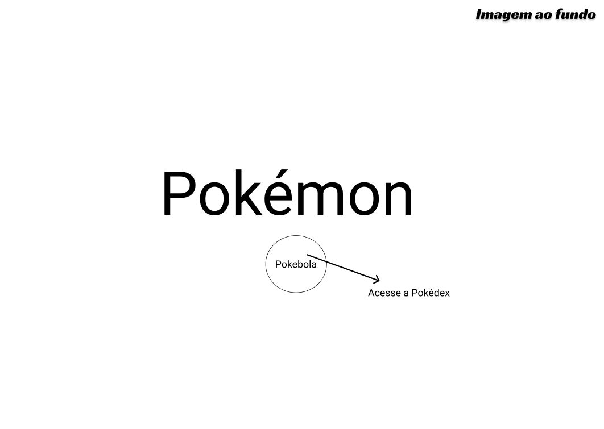
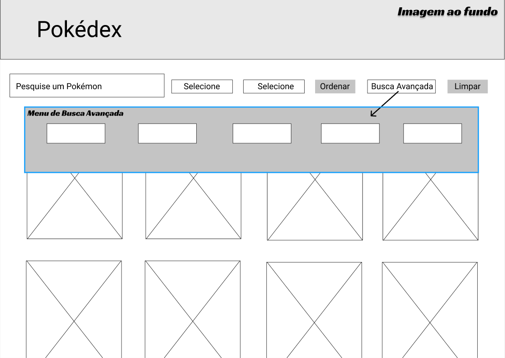
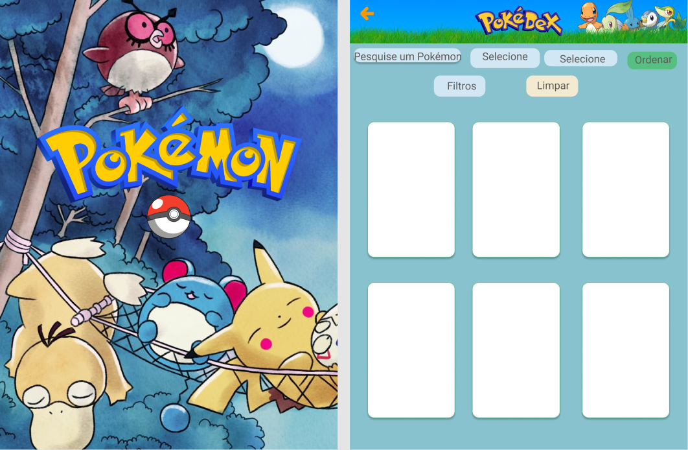
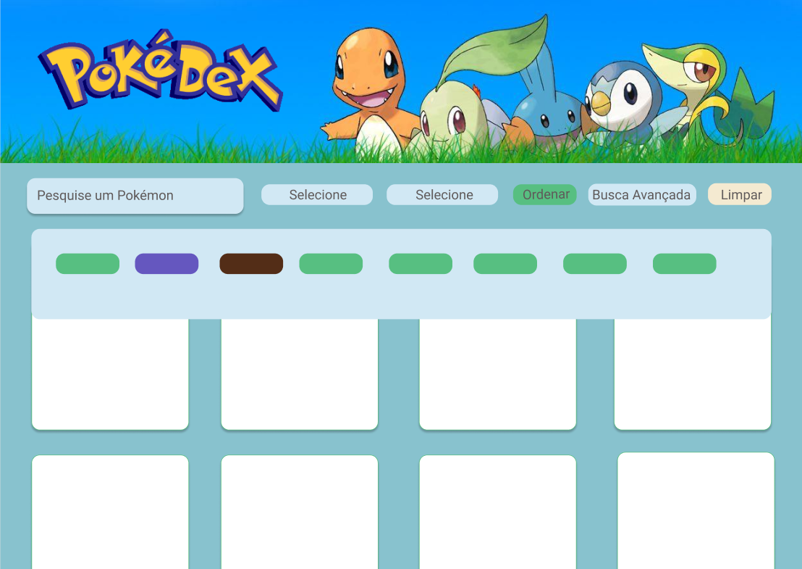

# PokeLovers :green_heart:

## Projeto 2 - Data Lovers desenvolvido no bootcamp de Front-End da SAP006 Laboratória :yellow_heart:

## Índice

* [1. Sobre o produto](#dart-sobre-o-produto)
* [2. Tipos de Violência contra Mulher](#woman-tipos-de-violência-contra-mulher)
* [3. Nosso Propósito](#heart-nosso-propósito)
* [4. Como usar?](#gear-como-usar)
* [5. Links para Redes de Apoio à Mulher](#link-links-para-redes-de-apoio-à-mulher)
* [6. Tecnologias](#robot-tecnologias)
* [7. Resultados](#%EF%B8%8F-resultados)
* [8. Sobre a autora](#woman_technologist-sobre-a-autora)

---
## :dart: Definição do Produto

O [PokeLovers](..) foi desenvolvido com o objetivo de auxiliar os consumidores de conteúdos relacionados aos Pokémons da 1ª e da 2ª Geração. Esta aplicação tem a missão de prover informações aos usuários de forma dinâmica e divertida. 

O layout do site representa a interação com uma verdadeira Pokédex (também conhecida como Poké-Agenda no Brasil) que é uma enciclopédia virtual portátil de alta tecnologia que os treinadores Pokémon transportam para registrar todas as espécies diferentes que são encontradas durante as suas aventuras. 

O seu design é responsivo para desktop, mobile (365px) e tablet (768px), o que proporcional a versatilidade desejada pelos usuários. A sua idealização foi feita a partir de protótipos de baixa e de alta fidelidade que nortearam a construção do site de acordo com as necessidades dos clientes. Nele, é possível buscar os Pokémons pelos seus nomes, filtrá-los por tipo, geração, resistências, fraquezas..., além de poder ordená-los por raridade, distância dos ovos, probabilidade de aparição, ordem alfabética...Em sua interface, também são disponibilizadas as informações de cada Pokémon no verso de seus cards (basta passar o mouse por cima do Pokémon), tais como tamanho (peso e altura), estatísticas (ataque, defesa, stamina, poder de combate e pontos de vida), resistências, fraquezas e geração. Ao lado esquerdo desses cards, similarmente, existe um botão de interrogação que dá acesso a um popup com melhores explicações sobre as informações ditas anteriormente para auxilar àqueles usuários iniciantes.

Por fim, desejamos que nosso produto lhe proporcione uma incrível experiência dentro do universo Pokémon! :green_heart:

---
## :pencil2: Histórias de Usuários
Definição de pronto
Critérios de aceitação

---
## :art: Protótipos
### Baixa Fidelidade

### Alta Fidelidade
#### - Mobile (375px)

#### - Tablet (768px)

#### - Desktop (1440px)

---
## :gear: Como usar?
- Primeiramente o usuário acessará a página inicial, na qual, o acesso para a Pokedéx ocorre ao clicar na Pokébola;

### Na Pokedéx:
- O usuário é capaz de filtrar um Pokémon pelo seu respectivo nome no campo "Busque por um Pokémon"; 
- É possível ordenar os cards em ordem crescente ou decrescente para os atributos de **Nome**, **Raridade**, **Distância dos Ovos**, **Probabilidade de Aparição**; 
- A filtragem dos cards é independente da ordenção e os Pokemons podem ser selecionados de acordo com o seus **tipos**, **fraquezas** e **resistências**; É importante ressaltar que os filtros são independentes entre si;
- Ao passar o mouse em cima dos cards, os mesmos irão girar e informações adicionais serão exibidas. Quando isso ocorre, o usuário pode visualizar o **peso** e **altura** dos Pokemons, bem como as suas estatísticas **ataque-base**, **defesa-base**, **stamina-base**, **pontos de vida** e **força de combate**. Além disso, dados relativos as fraquezas, resistências e geração do indivíduo também poderão ser visualizadas; 
- À esquerda da tela, existe um botão para acessar detalhes das informações exibidas na tela. 
---
## :link: Links para Redes de Apoio à Mulher
* [PokemonGo](https://pokemongolive.com/pt_br/)
* [PokeDéx Completa (todas as gerações)](https://www.pokemon.com/br/pokedex/)

---
## :robot: Tecnologias 

- HTML 5
- CSS3
- JavaScript
- Jest
- Node.js

---

## :computer: Estrutura dos Arquivos

## ✔️ Resultados

---
## :woman_technologist: Sobre as autoras
### Patrícia Barnabé

- [LinkedIn](https://www.linkedin.com/in/patriciabarnabe)
- E-mail: patbarnabe5@gmail.com

### Laís Mune

- [LinkedIn](https://www.linkedin.com/in/laís-ayume-lima-mune)
- E-mail: aymune@hotmail.com